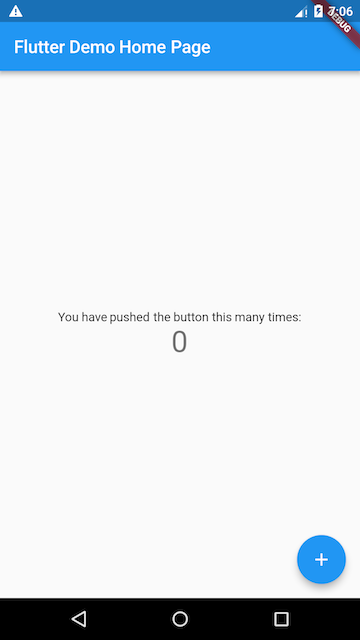

# 1.1 计数器示例

用Android Studio或VS Code创建的Flutter应用模板默认是一个简单的计数器示例。

### 1.1.1 创建Flutter应用模板 

通过Android Studio或VS Code创建一个新的Flutter工程，命名为"first\_flutter\_app"。创建好后，就会得到一个计数器应用的Demo。

在搭建环境的时候，你应该已经见到下图所示的计数器界面了。

在该示例中，每点击一次右下角带“+”号的悬浮按钮，屏幕中央的数字就会加1。如果你之前学习过redux，那么你应该会很熟悉这个改变

